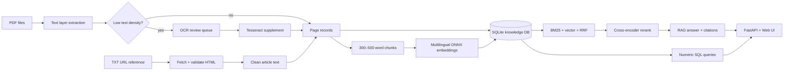

# Future Ready Talent Knowledge Platform

แพลตฟอร์มข้อมูลแรงงานที่นำ PDF และ URL reference เข้าแบบ idempotent, เก็บข้อมูลที่ตรวจสอบย้อนกลับได้ใน SQL, ทำ hybrid retrieval และแสดงเรื่องราว demand vs readiness ผ่าน dashboard/chat

## RAG + MCP CLI (primary interface)

CLI เป็น entry point หลักของ AI backend ส่วน FastAPI และ frontend เดิมยังทำงานเหมือนเดิมและเป็น optional interface

```bash
cp .env.example .env

# สร้าง optional competition tables ใน SQLite
python3 cli.py seed-db

# โหลด PDF จาก path ที่ config ไว้, chunk, embed และ index
python3 cli.py index

# interactive
python3 cli.py

# one-shot / machine-readable
python3 cli.py ask "Who pays for the platform?"
python3 cli.py ask "Who pays for the platform?" --json
```

ทุกคำตอบถูกบังคับให้มี retrieved PDF evidence ก่อนเสมอ และ output แสดง source filename, page,
chunk IDs และ execution time หาก router พบคำถามเชิง structured data ระบบจะเรียก read-only SQL tool
ผ่าน MCP boundary แล้วส่งทั้ง PDF chunks และ SQL rows ให้ LLM ก่อนสังเคราะห์คำตอบ

ค่าทั้งหมดอยู่ใน [`config/settings.json`](config/settings.json) และ override ด้วย environment variables
ใน [`.env.example`](.env.example) ได้ ไม่มี API key หรือ PDF path ฝังใน source code

### Components and swap points

```text
cli.py -> QuestionRouter -> Retriever -> EmbeddingProvider -> VectorStore
                         \-> MCP Client -> MCP SQL Server -> SQL backend
PDF -> PdfTextLoader -> Chunker -> Indexer -----------------> VectorStore
PDF evidence + SQL evidence -> LLMProvider -> grounded answer
```

Protocol/interface definitions อยู่ใน `core/interfaces.py`; implementations ปัจจุบันคือ FastEmbed
(fallback เป็น deterministic local hash), local SQLite vector store, OpenAI Responses adapter
(Ollama local adapter และ fallback extractive), และ read-only SQLite MCP tools การเปลี่ยน LLM, embeddings, vector database
หรือ SQL backend ทำได้ด้วย adapter ใหม่โดยไม่แก้ business logic ใน `AnswerService`

ทดสอบด้วย Ollama โดยไม่ต้องลบ OpenAI config:

```bash
ollama serve
ollama pull llama3.1:8b
```

แล้วตั้งเฉพาะใน `.env`:

```env
FRT_LLM_PROVIDER=ollama
OLLAMA_MODEL=llama3.1:8b
FRT_LLM_BASE_URL=http://localhost:11434
```

กลับไปใช้ OpenAI ได้ทันทีด้วย `FRT_LLM_PROVIDER=openai` และ `OPENAI_MODEL=...`

MCP server แบบ stdio:

```bash
python3 -m mcp.server
```

รองรับ `initialize`, `ping`, `tools/list`, `tools/call` และ tools:
`search_people`, `search_budget`, `search_company`, `search_project`,
`execute_readonly_sql` โดย SQL จำกัดเฉพาะ statement เดียวแบบ `SELECT`/`WITH`,
เปิด database ด้วย `mode=ro` และใช้ SQLite authorizer ปฏิเสธ write operation

### Benchmark

แก้ question set ที่ `benchmark/questions.json` และ model mapping ที่
`benchmark/models.json` แล้วรัน:

```bash
python3 -m benchmark.benchmark
```

ระบบสร้าง `benchmark/results.md` และ `benchmark/results.json` โดยวัด latency,
expected-keyword accuracy, จำนวน retrieved chunks, citation quality,
numeric hallucination rate และ token usage ชื่อ/ID โมเดลแยก config ไว้เพื่อรองรับ
model IDs ที่บัญชี competition เปิดให้ใช้

## เริ่มใช้งาน

ต้องมี Python 3.11+, `pdftotext` และ `pdftoppm` (แพ็กเกจ poppler-utils)

### Ubuntu/Debian ที่เปิด PEP 668

วิธีนี้ติดตั้ง dependency ไว้ใน `.python-deps` ภายในโปรเจกต์ ไม่แก้ system Python และไม่ต้องใช้ `--break-system-packages`:

```bash
./scripts/setup-local.sh
python3 -m app.ingest
PYTHONPATH=.:.python-deps python3 -m app.reindex_embeddings
./scripts/run-local.sh
```

### เครื่องที่สร้าง virtual environment ได้

```bash
python -m venv .venv
source .venv/bin/activate
pip install -r requirements.txt
cp .env.example .env
python -m app.ingest
python -m app.reindex_embeddings
uvicorn app.main:app --reload
```

ถ้า `python -m venv` แจ้งว่าไม่มี `ensurepip` สามารถใช้วิธี `.python-deps` ด้านบนได้ทันที หรือเลือกติดตั้งแพ็กเกจระบบ `python3-venv` ภายหลัง

เปิด `http://localhost:8000` และ API docs ที่ `http://localhost:8000/docs` หรือใช้ Docker:

```bash
export DOCKER_UID="$(id -u)"
export DOCKER_GID="$(id -g)"
docker compose build --pull
docker compose run --rm app python -m app.ingest
docker compose run --rm app python -m app.reindex_embeddings
docker compose up -d
```

คู่มือ build, healthcheck, rebuild และการแก้ Docker socket permission อยู่ที่ [`docs/docker.md`](docs/docker.md)

การ ingest รอบถัดไปจะข้ามเอกสารที่ hash ไม่เปลี่ยน URL ที่ fetch ไม่สำเร็จหรือได้ข้อความสั้นผิดปกติจะถูก log และไม่สร้าง document ว่าง

หากมีทั้ง URL reference และ PDF ฉบับเต็มของรายงาน TDRI/UNICEF ชุดเดียวกัน pipeline จะใช้ PDF เป็นแหล่งหลักและข้าม `.txt` ที่ถูกแทนที่ เพื่อรักษา document ID เดิมและให้ citation เปิดไฟล์จริงพร้อมเลขหน้า

## OCR และ RAG

Pipeline ใช้ text layer ก่อนและ flag หน้าที่ข้อความน้อยให้ review ใน `extraction_logs` หากติดตั้ง Tesseract พร้อมภาษาไทย/อังกฤษแล้วให้รัน:

```bash
python -m app.ocr
# จำกัดงานเพื่อ review ทีละชุด
python -m app.ocr --limit 20
```

OCR จะไม่ทับข้อความเดิม แต่ต่อเป็น supplement และ rebuild index เฉพาะเอกสารที่เปลี่ยน Chunk แยก `narrative` กับ `chart_ocr` เพื่อให้ citation บอกชนิดหลักฐานได้

Retrieval ใช้ SQLite FTS5/BM25 ร่วมกับ multilingual ONNX embedding แล้วรวมอันดับด้วย Reciprocal Rank Fusion ก่อน cross-encoder re-ranking โมเดลจะดาวน์โหลดครั้งแรกลง `data/model-cache` และทำงาน offline จาก cache ได้ การ re-index สร้าง vector ใน `chunk_embeddings_v2` แยกจาก legacy index ตรวจจำนวน/dimension ให้ครบก่อน activate จึง rollback ได้ หากไม่มี FastEmbed หรือ active index ระบบยัง fallback ไป legacy index โดย extractive mode ไม่หยุดทำงาน

หากตั้ง `OPENAI_API_KEY` chat จะให้โมเดลสังเคราะห์คำตอบจาก context ที่ค้นได้; ถ้าไม่ตั้ง ระบบคืน grounded extract โดยตรง

ตัวเลขบน dashboard query จาก `job_demand` และ `analytics_metrics` ใน SQL เท่านั้น ไม่ผ่าน RAG ข้อมูล seed ที่ยืนยันแล้วระบุ `source_document_id` และ `source_page` ทุกแถว

Dashboard มีมุมมอง global demand, Thai readiness และ demand-vs-readiness พร้อมหลักฐาน PDF ไทยเพิ่มอีกสามชุด: งานเปิดรับจาก TDRI-JPA, สัดส่วนผู้จบ STEM ที่ทำงานอาชีพ STEM และช่องว่างการเข้าถึง/ความต้องการฝึกอบรม กราฟสุดท้ายยังแสดงสถานะ partial เพราะไม่มี readiness รายทักษะหรือ curriculum coverage และจะไม่สร้างตัวเลขแทนข้อมูลที่ขาด

## API หลัก

- `GET /api/dashboard` — ตัวเลขและทักษะจาก SQL
- `GET /api/documents` — แหล่งข้อมูลและสถานะ OCR review
- `GET /api/search?q=...` — retrieved chunks พร้อมหน้าและ score
- `POST /api/chat` — คำตอบพร้อม citations
- `GET /api/documents/{id}/pages/{page}` — หลักฐานระดับหน้า
- `GET /api/documents/{id}/source` — เปิด PDF ต้นฉบับที่นำเข้า
- `GET /api/health` — จำนวน documents/chunks

## Architecture



รายละเอียด schema อยู่ใน `app/schema.sql`: `documents`, `document_pages`, `industries`, `skills`, `job_demand`, `skill_requirements`, `chunks`, `chunk_fts` และ `extraction_logs` SQLite เหมาะกับ demo/deployment ขนาดเล็ก; สำหรับหลาย worker สามารถย้าย repository layer ไป PostgreSQL + pgvector โดยคง provenance model เดิม

## ตรวจสอบ

```bash
python -m unittest discover -s tests -v
python -m compileall -q app
PYTHONPATH=.:.python-deps python evaluation/run_retrieval_eval.py
```

ผล evaluation ปัจจุบันเพิ่ม hit@3 จาก 27.78% เป็น 55.56% ดูรายละเอียดใน `evaluation/retrieval_report.md`
